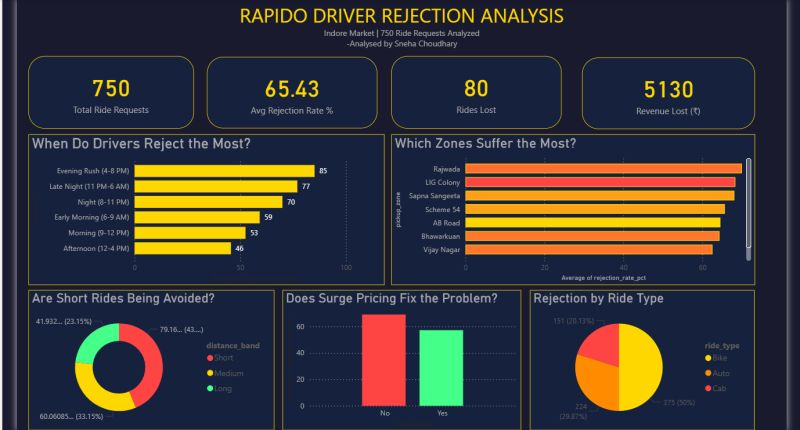

# 🛵 Rapido — Ride Cancellation & Revenue Leakage Analysis

> *"What's killing revenue one cancelled ride at a time?"*

A full-cycle business analysis project on **750 ride requests** from the Indore market — identifying when, where, and why drivers reject rides, and quantifying the revenue impact for operational decision-making.

---

## 📊 Dashboard Preview

---

## 🔢 Key Numbers

| Metric | Value |
|---|---|
| Total ride requests analyzed | **750** |
| Average rejection rate | **65.43%** |
| Rides lost to cancellation | **80** |
| Recoverable revenue identified | **₹5,130+** |

---

## ❓ The Questions I Asked

- When do drivers reject the most — and is it predictable?
- Which pickup zones suffer the highest rejection rates?
- Does surge pricing actually fix the problem, or make it worse?
- Are short rides being systematically avoided?
- Which ride types (Bike / Auto / Cab) see the most rejection?

---

## 🔍 Key Findings

**1. Evening rush is the danger zone**
Rejection rates peak at **85% between 4–8 PM** — nearly double the afternoon rate of 46%. Late night (11 PM–6 AM) comes second at 77%, suggesting driver availability and willingness diverge sharply from demand during these windows.

**2. Geography matters more than pricing**
Rajwada and LIG Colony consistently top the high-rejection zones. These aren't random — they share dense pickup congestion and short average trip distances, making them unattractive to drivers relative to effort.

**3. Surge pricing doesn't solve rejection**
The data shows higher rejection rates *with* surge pricing active than without. Drivers are declining surge rides, suggesting the multiplier isn't large enough to offset perceived inefficiency of the trips.

**4. Short rides are being quietly avoided**
Medium-distance rides (43%) dominate completed trips, while short rides are disproportionately rejected — indicating drivers are filtering by distance before accepting.

**5. Cabs carry the most rejection burden**
At 375 rejections (50%), Cab rides are rejected at the highest volume, followed by Auto (224, ~30%) and Bike (151, ~20%).

---

## 💡 Recommendations

- **Reallocate drivers** proactively into high-rejection zones (Rajwada, LIG Colony) during 4–8 PM peak
- **Revise surge multipliers** — current thresholds are not incentivizing driver acceptance
- **Introduce short-ride incentives** to reduce distance-based filtering by drivers
- **Monitor evening shift supply** — late night rejection at 77% signals a supply-demand gap worth addressing with shift-based bonuses

---

## 🛠️ Tools Used

- **SQL (MySQL)** — data extraction, cleaning, aggregation, zone-level grouping
- **Power BI** — interactive dashboard, DAX KPIs, heatmaps, donut & bar charts
- **DAX** — custom measures for rejection rate %, revenue loss calculation

---

## 📁 Files in this Repo

| File | Description |
|---|---|
| `RAPIDO DRIVER REJECTION ANALYSIS.sql` | All SQL queries — extraction, cleaning, aggregation |
| `Rapido.pbix` | Power BI dashboard file |
| `dashboard.png` | Dashboard screenshot |

---

## 👩‍💻 About

Built by **Sneha Choudhary** — MBA Business Analytics (2026), former Business Analytics Intern at CARS24.

